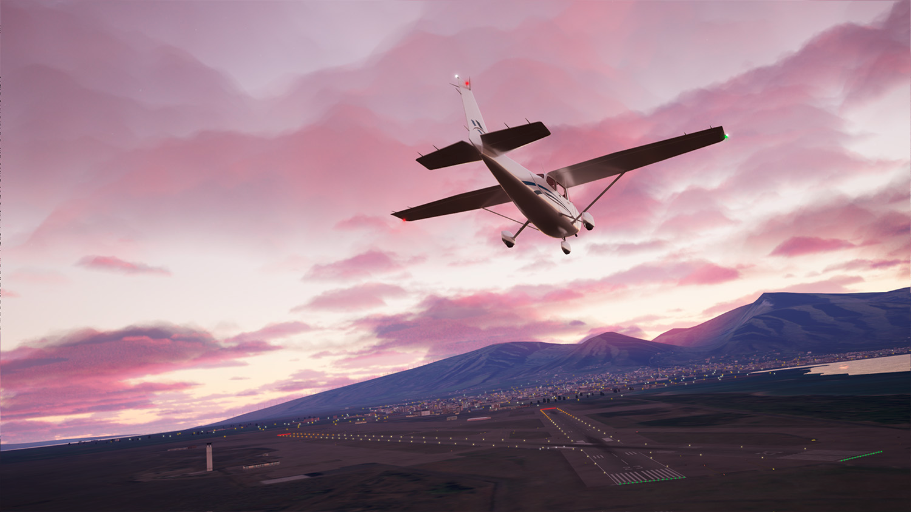
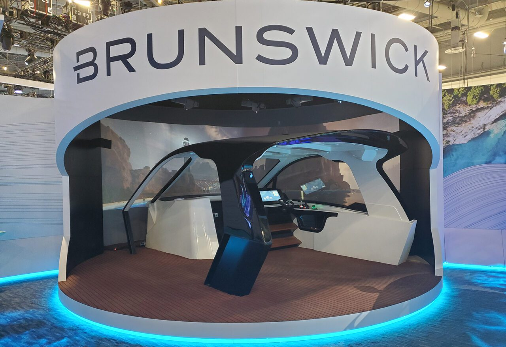

+++
date = '2025-12-07T17:22:04-06:00'
draft = false
title = 'About'
+++

Hello! I'm a graphics software engineer, add-on creator, and 3D generalist.

I graduated from UIUC in 2023 with a degree in Mathematics and Computer Science

I've had the privilege to work on many cool projects, including:
* [NodeToPython](https://extensions.blender.org/add-ons/node-to-python/) - A Blender add-on for making add-ons out with Geometry Nodes, Materials, Compositor nodes, and more.
    

* [Vital FVS 100](https://www.frasca.com/frasca-advances-flight-training-technology-with-new-visual-system-powered-by-unreal-engine/) - Frasca International's new Unreal Engine 5-powered image generator for flight simulation
    
    (Copyright Frasca International, 2025)

* [Brunswick's Future Helm](https://www.brunswick.com/our-company/ces-2023) - An immersive, interactive boating simulator showcasing new autonomous boating features at CES 2023 
    
    (Copyright Brunswick Corporation, 2023)